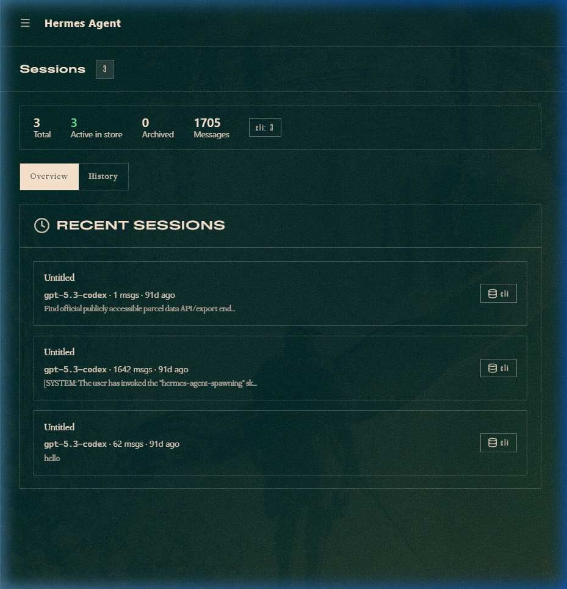
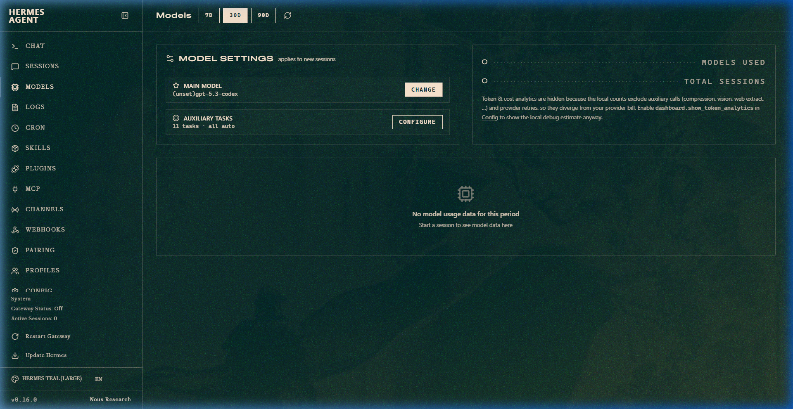
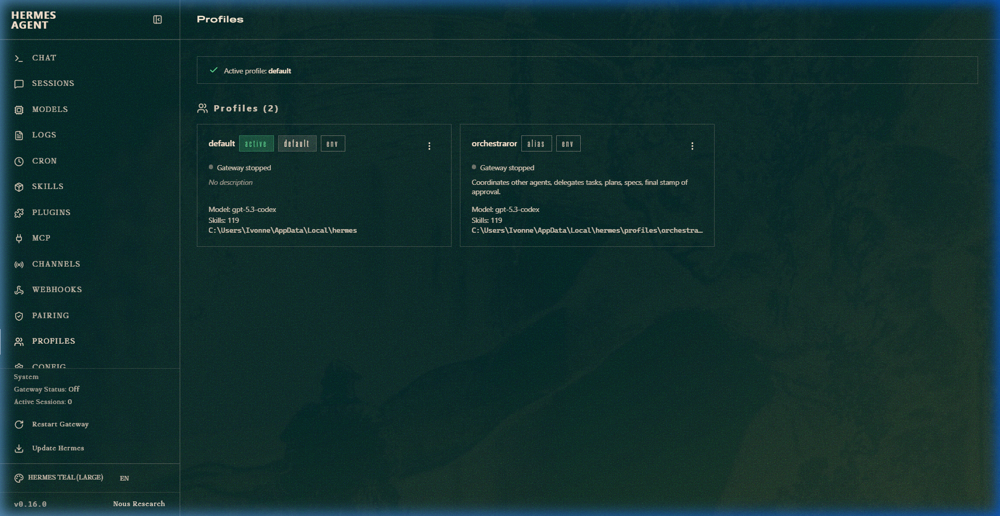
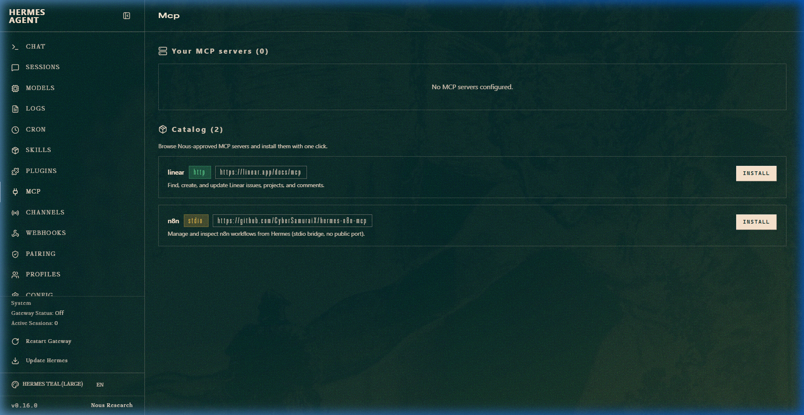
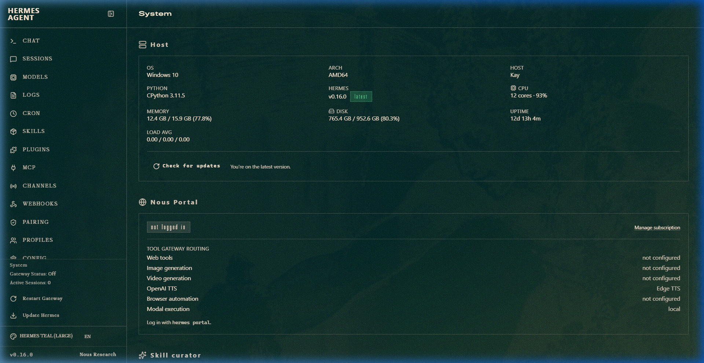
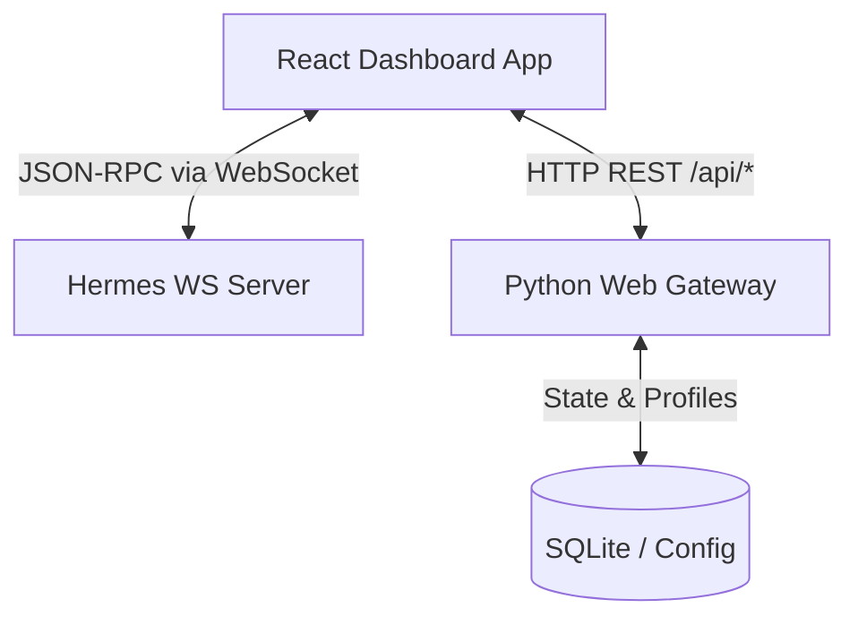

# 🏛️ Trismegistus Dashboard

> **A premium, high-fidelity control plane for the Hermes Agent system.**
> Reimagined in React 19, Vite 7, and Tailwind CSS 4, built with the gorgeous `@nous-research/ui` design system.

---

<p align="center">
  
</p>

## ✨ The Control Plane, Re-imagined
Trismegistus Dashboard is a decoupled frontend web app built to interface with the local **Hermes Agent** backend. The interface is meticulously crafted using HSL-tailored colors, smooth gradients, dynamic micro-animations, and glassmorphism elements to provide a state-of-the-art developer control deck.

---

## 🎨 Visual Showcase & Features

### 📂 Sessions Hub
Manage all active and archived agent conversations. The Sessions panel features paginated list structures, title renaming, batch deletion utilities, and full-text search index (FTS5) capabilities, wrapped in a beautiful dark teal canvas.

<p align="center">
  
</p>

### 🧠 Cognitive & Model Analytics
Observe token usage ratios, cost estimations, and performance matrices across diverse providers (Ollama, OpenRouter, Anthropic, OpenAI). The **Models** view plots input vs. output distributions using HSL-inverted data-series accents, rendering complex metrics as intuitive token flows.

<p align="center">
  
</p>

### 👤 Profile Orchestration
Toggle active agent profiles or configure custom ones with explicit agent personalities ("souls"), system prompts, and default models. Profiles can be generated, updated, cloned, or tested directly with setup commands.

<p align="center">
  
</p>

### 🔌 Model Context Protocol (MCP)
Register stdio/http transports to give your agent external capabilities. Configure environment keys, catalog dependencies, and test servers in real time.

<p align="center">
  
</p>

### ⚙️ System Diagnostics
Monitor CPU load, active threads, memory thresholds, disk storage limits, and live gateway runtime statuses. Keep track of underlying CLI processes inside a soothing visual terminal.

<p align="center">
  
</p>

---

## 🚀 Key Architectures

- **Decoupled Gateway client:** Interfaces directly with the backend's JSON-RPC over WebSocket protocol.
- **Multilingual Support (i18n):** Deep translation system supporting English and 16 other locales.
- **Dynamic Themes:** Pre-configured lens presets (Midnight, Cyberpunk, Ember, Rosé, and Nous Blue light-mode) that rewrite typography, layout, and palettes instantly on root CSS variables.



---

## 🛠️ Getting Started

To launch the project locally, make sure you have [Node.js](https://nodejs.org/) installed, then run the commands below.

> [!TIP]
> The project includes a `justfile` for command automation. If you have `just` installed on your system, you can use the shortcut recipes.

### Running with `just`
```bash
# Start the local development server with proxy setup
just dev

# Run TypeScript type safety checks
just typecheck

# Build the optimized production bundle
just build
```

### Running with `npm`
```bash
# Install dependencies
npm install

# Start local server
npm run dev

# Build the bundle
npm run build
```

---

> Created with 🧪 by Kevin Gastelum. Soothing design for high-performance agentic engineering.
